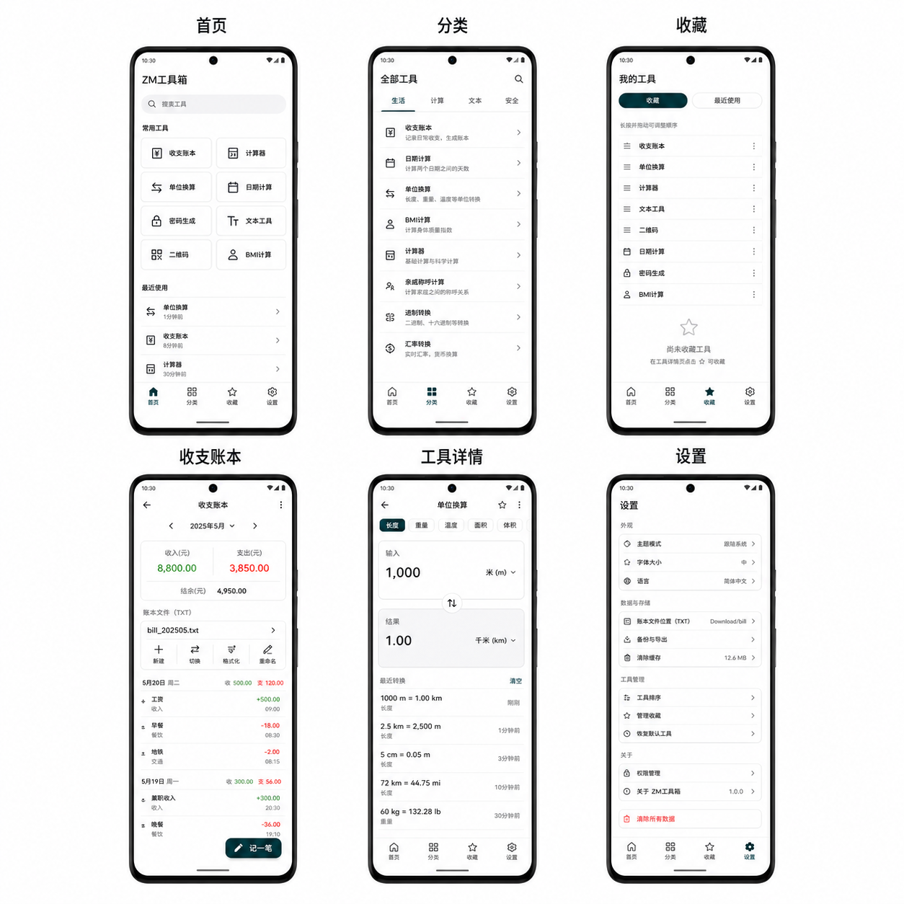

# ZM 工具箱

一款简洁、本地优先的 Flutter 多功能工具 App。当前提供 37 个离线工具，并完整保留原有收支账本、分类统计、多 TXT 账本切换和 Android 公共目录自动同步功能。



## 功能

- 工具箱首页、分类筛选、搜索、收藏和最近使用
- 简体中文界面，内置日期、时间选择器及文本操作菜单统一使用中文
- 基础计算器（不执行输入代码）
- 长度、重量和温度单位换算
- 日期间隔和日期推算
- 使用安全随机数的本地密码生成器
- 文本字数统计、大小写转换、空行清理和 HTML 实体编解码
- 纯本地二维码生成
- BMI 计算
- 秒表与倒计时
- 百分比、折扣和 AA 分摊
- 年龄和生日倒计时
- 随机数、骰子、硬币和名单抽取
- 可持久化的多项目计数器
- 逐行文本对比
- 列表排序、去重、打乱和清理
- JSON 格式化、压缩和校验
- Base64 UTF-8 文本编码与解码
- URL 组件编码、解码和查询参数解析
- Unix 秒/毫秒时间戳与本地日期互转
- 二、八、十、十六进制任意精度整数转换
- 使用安全随机源的 UUID v4 批量生成
- 带超时隔离保护的正则表达式测试
- MD5、SHA-1、SHA-256 和 SHA-512 文本哈希，SHA-256/SHA-512 HMAC，以及 Android 系统文件选择器提供的只读文件完整性校验（最大 512 MB）
- WCAG 颜色对比度与 AA/AAA 检查
- 只读 JWT Header、Payload 和有效期查看
- CSV 与扁平 JSON 对象数组双向转换
- 标准 5 段 Cron 解析和后续执行时间计算
- 中文 / 拉丁占位文本，按段数与句数生成，最多 20 段、每段 10 句
- IPv4 子网计算，支持 /0–/32，不扫描网络或枚举主机
- 三位 Unix 权限与勾选互转，不执行命令或修改文件
- Luhn 数字序列校验与校验位生成，不代表号码真实有效；不保存输入
- 安全 Markdown 子集预览，不执行 HTML、脚本或网络资源
- 常用 HTTP 状态码离线查询，不发送网络请求
- 常见扩展名与 MIME 类型离线查询，不读取或嗅探文件
- JPEG、PNG 和 WebP 图片离线压缩、缩放与格式转换，默认移除元数据，输出保存到 `Pictures/ZM工具箱`
- 宽高比约分与等比尺寸换算
- 原有收支账本完整保留：
- 记录收入和支出原因、金额、分类与日期
- 按天查看、添加、修改和删除记录
- 按月份统计收入、支出、结余及消费种类
- 每个月自动创建默认 TXT
- 在同一个月份新建多个独立 TXT，并在文件之间切换
- 每个 TXT 的记录与统计互相隔离
- 自定义 TXT 文件名
- 每个 TXT 可单独选择行首格式
- 修改记录后自动更新公共 TXT，无需手动下载

## TXT 格式

基本规则：

- 每个日期占一行
- 同一天的多笔记录使用英文逗号 `,` 分隔
- 支出金额不带减号
- 只有收入金额带 `+`
- 原因中的换行、英文逗号和英文冒号会被安全转换，避免破坏文件结构

每个 TXT 可以独立选择以下格式。

日期开头（默认）：

```text
1日:午饭:18.8,工资:+6200
2日:公交:2,晚饭:25
```

完整日期开头：

```text
2026年8月1日:午饭:18.8,工资:+6200
2026年8月2日:公交:2,晚饭:25
```

TXT 是 App 自动生成的副本。请通过 App 修改账目，不要直接编辑公共 TXT，否则下一次同步会覆盖手工修改。

## Android 文件位置

首次打开 App 后会创建当年目录和当月默认 TXT：

```text
/storage/emulated/0/Download/bill/2026/2026年8月消费.txt
```

创建多个文件后的示例：

```text
Download/
└── bill/
    ├── 2026/
    │   ├── 2026年8月消费.txt
    │   ├── 家庭.txt
    │   └── 工作报销.txt
    └── 2027/
        └── 2027年1月消费.txt
```

Android 10 及以上通过 MediaStore 写入公共下载目录，不申请“所有文件访问权限”。Android 9 及以下首次保存时需要传统存储权限。应用内部还会保留主账本，公共 TXT 被误删不会直接删除 App 内记录。

## 使用方法

1. 点击“记一笔”，选择收入或支出并填写内容。
2. 点击月份区域左右按钮切换月份。
3. 点击 TXT 文件卡片切换当前文件。
4. 点击文件卡片右侧的新建图标创建空白 TXT。
5. 点击格式图标选择“日期开头”或“完整日期开头”。
6. 点击铅笔图标修改当前 TXT 名称。

## 项目信息

- Flutter/Dart 项目
- Android Application ID：`com.zm.bill`
- iOS Bundle ID：`com.zm.bill`
- 当前版本：`1.0.0+1`
- 工具内容仅在本机处理，不上传服务器
- 工具箱只持久化收藏和最近使用的工具编号
- 密码生成使用安全随机数，结果不写入文件
- 二维码只在本地绘制，不申请相机、相册或联网权限

主要目录（每个工具均为独立模块）：

```text
lib/
├── app/                    # 工具箱外壳、页面、状态和偏好
├── core/                   # 统一主题
├── tools/
│   ├── expense/            # 完整账本模块（页面、业务、模型、存储、组件）
│   ├── calculator/         # 计算器
│   ├── unit_converter/     # 单位换算
│   ├── date_calculator/    # 日期计算
│   ├── password_generator/ # 密码生成
│   ├── text_tools/         # 文本工具
│   ├── qr_code/            # 二维码
│   ├── bmi_calculator/     # BMI
│   ├── stopwatch_timer/    # 秒表与倒计时
│   ├── percentage_calculator/ # 百分比
│   ├── bill_split/         # AA 分摊
│   ├── age_calculator/     # 年龄计算
│   ├── random_decision/    # 随机决定
│   ├── tally_counter/      # 计数器
│   ├── text_diff/          # 文本对比
│   ├── list_processor/     # 列表处理
│   ├── json_tool/          # JSON 工具
│   ├── base64_tool/        # Base64
│   ├── url_tool/           # URL 编解码与参数解析
│   ├── timestamp_converter/ # Unix 时间戳
│   ├── number_base_converter/ # 进制转换
│   ├── uuid_generator/     # UUID v4 生成
│   ├── regex_tester/       # 正则测试
│   ├── hash_generator/     # 文本/文件哈希与 HMAC
│   ├── color_contrast/     # 颜色与对比度
│   ├── jwt_viewer/         # JWT 只读查看
│   ├── csv_json_converter/ # CSV/JSON 转换
│   ├── cron_parser/        # Cron 解析
│   ├── placeholder_text/   # 占位文本
│   ├── ipv4_subnet/        # IPv4 子网计算
│   ├── chmod_calculator/   # Unix 权限计算
│   ├── luhn_checker/       # Luhn 校验
│   ├── markdown_preview/   # Markdown 预览
│   ├── http_status_reference/ # HTTP 状态码
│   ├── mime_type_reference/ # MIME 类型
│   ├── image_optimizer/    # 图片压缩、缩放与格式转换
│   └── aspect_ratio_calculator/ # 宽高比计算
└── expense_storage.dart    # 账本旧导入路径的兼容出口
```

## 开发环境

开发或重构前必须先阅读 [开发规范](DEVELOPMENT_GUIDE.md)。该规范定义了工具目录、UI、安全、离线处理、账本兼容、测试和正式构建要求。

安装 Flutter SDK 和 Android Studio，并确认环境正常：

```powershell
flutter doctor
```

获取依赖并运行：

```powershell
flutter pub get
flutter run
```

代码检查与测试：

```powershell
flutter analyze
flutter test
```

## 正式签名

正式版必须使用自己的签名文件。项目不会使用调试证书生成 release；缺少 `android/key.properties` 时，正式构建会主动停止。

### 1. 创建签名文件

在 Windows PowerShell 中运行：

```powershell
keytool -genkeypair -v -keystore "$env:USERPROFILE\upload-keystore.jks" -keyalg RSA -keysize 2048 -validity 10000 -alias upload
```

如果系统找不到 `keytool`，可以使用 Android Studio 自带版本，例如：

```powershell
& "F:\Android\Android Studio\jbr\bin\keytool.exe" -genkeypair -v -keystore "$env:USERPROFILE\upload-keystore.jks" -keyalg RSA -keysize 2048 -validity 10000 -alias upload
```

按提示在本机输入密码。不要把密码、`.jks` 文件或 `key.properties` 提交到 Git 或发给他人。

### 2. 创建签名配置

复制模板：

```powershell
Copy-Item android/key.properties.example android/key.properties
```

编辑 `android/key.properties`：

```properties
storePassword=你的签名库密码
keyPassword=你的密钥密码
keyAlias=upload
storeFile=C:/Users/你的用户名/upload-keystore.jks
```

`android/key.properties` 和所有 `.jks` 文件已被 `.gitignore` 排除。

## 打包

直接安装或分发 APK：

```powershell
flutter build apk --release
```

输出文件：

```text
build/app/outputs/flutter-apk/app-release.apk
```

发布 Google Play 的 AAB：

```powershell
flutter build appbundle --release
```

输出文件：

```text
build/app/outputs/bundle/release/app-release.aab
```

发布更新前必须递增 `pubspec.yaml` 中的版本号，例如：

```yaml
version: 1.0.1+2
```

请永久备份签名文件和密码。使用同一个包名发布后，后续版本必须使用兼容的签名才能覆盖安装和正常更新。

## 注意事项

- `com.zm.bill` 与早期测试包名 `com.example.bill` 会被手机视为两个不同的 App。
- 更换包名不会迁移旧测试版的应用内部数据，但 `Download/bill` 中的公共 TXT 会继续保留。
- 卸载 App 前建议确认公共 TXT 已正常生成。
- 不要把账目原因、金额、签名密码或私钥写入日志和代码仓库。
